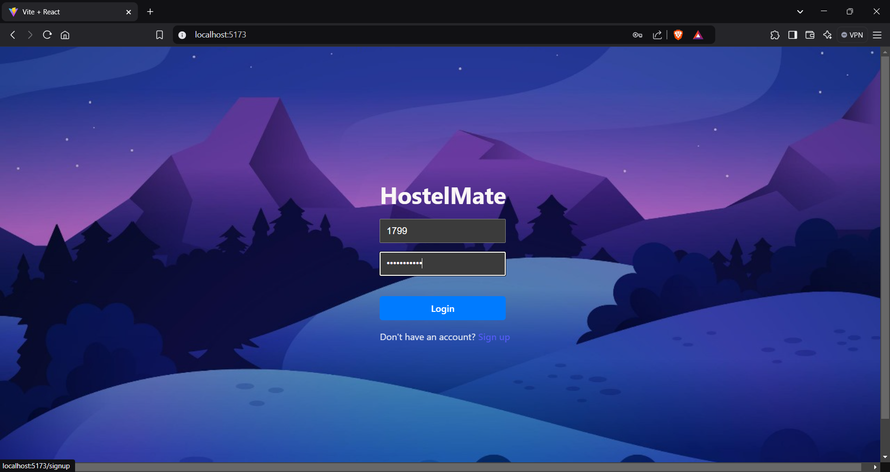
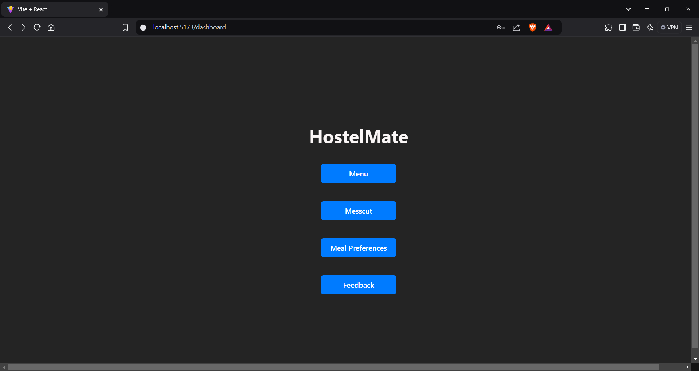
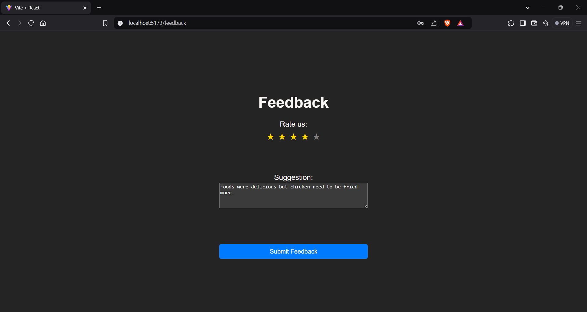
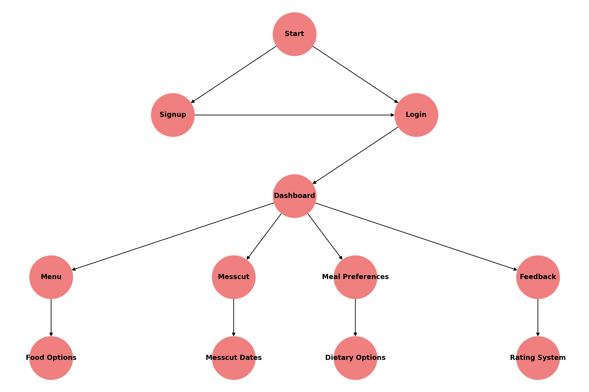
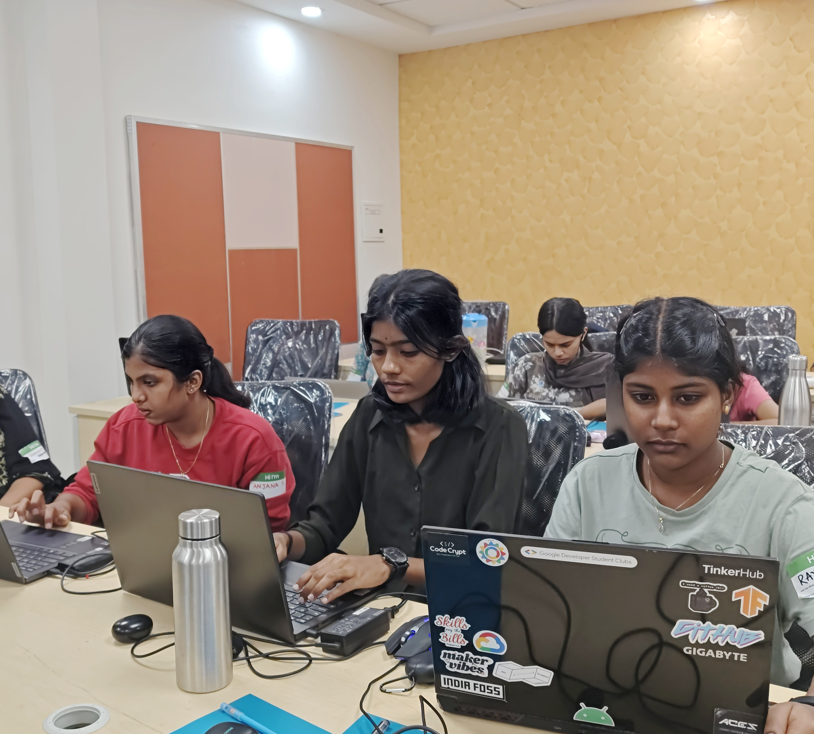

# HostelMate ✨

## Basic Details

**Team Name:** Stack

**Team Members:**

- Member 1: Anjana S - NSS College of Engineering Palakkad
- Member 2: Vedasree M - NSS College of Engineering Palakkad
- Member 3: Rayhana S - NSS College of Engineering Palakkad

**Hosted Project Link**  
[mention your project hosted project link here]

## Project Description

HostelMate is an all-in-one hostel management platform designed to simplify the day-to-day activities of hostel residents. It offers seamless login and signup features, meal management, mess cut requests, and personalized food preferences, ensuring a hassle-free hostel experience.

## The Problem Statement

Managing hostel activities manually can be cumbersome, leading to miscommunication, meal mismanagement, and lack of streamlined feedback mechanisms. Hostel residents often face issues in meal preferences, mess cut requests, and daily hostel services.

## The Solution

HostelMate provides a digital solution to efficiently handle hostel-related tasks. With easy-to-use features like login/signup, meal preference selection, mess cut requests, and feedback submission, it offers a one-stop solution to enhance the hostel experience.

## Technical Details

**Technologies/Components Used**

**For Software:**

- **Languages used**: HTML, CSS, JavaScript, Python
- **Frameworks used**: React.js, Django,React Router
- **Libraries used**: React , React Router DOM
- **Tools used**: GitHub, VSCode, Git

## Implementation

**For Software:**

**Installation**

```bash
# Clone the repository
git clone https://github.com/AnjanaS2004/HostelMate.git

# Install dependencies
cd HostelMate
pip install -r requirements.txt
npm install
```

**Run**

```bash
# Start the backend server
python manage.py runserver

# Start the frontend
npm start
```

## Project Documentation

**For Software:**

**Screenshots**

  
*Login page of HostelMate where users can log in or sign up.*

  
*Dashboard containing key functionalities such as menu, mess cut, meal preferences, and feedback.*

  
*Feedback and rating page allowing users to provide their opinions and rate their experience.*

**Diagrams**

  
*Workflow of the HostelMate system from user authentication to dashboard navigation.*

**Build Photos**



## Project Demo

**Video**

[Demo Video](https://youtu.be/BSIcxKaWgsM)
*This video demonstrates HostelMate's features, including login, meal preferences, and feedback submission.*

## Team Contributions

- **Anjana S**: Developed the frontend UI using React and integrated routing.
- **Vedasree M**: Built the backend API with Django for authentication and data management.
- **Rayhana S**: Designed the database schema and implemented feedback functionality.

Made with ❤️ at TinkerHub

